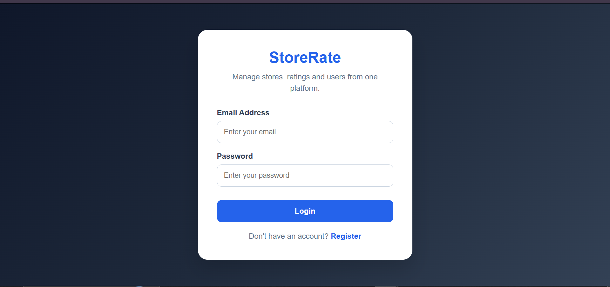
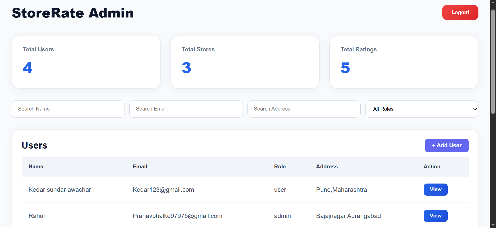
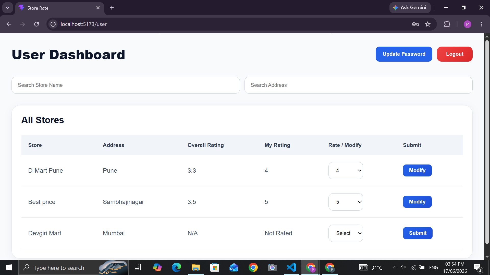
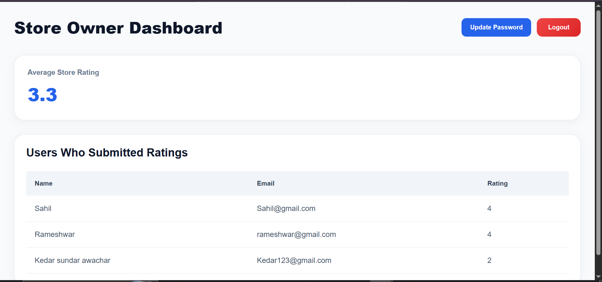
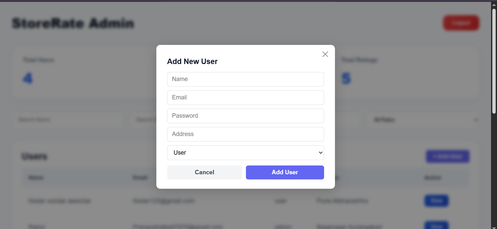
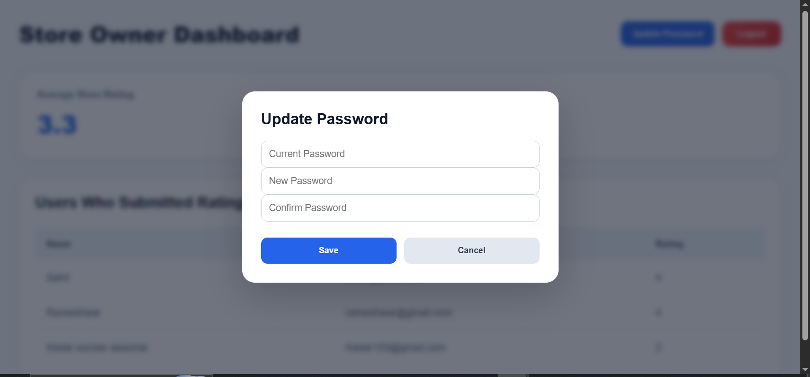

# ⭐ Store Rating Platform

A full-stack Store Rating Platform built using React, Node.js, Express.js, MySQL, JWT Authentication, and Role-Based Access Control.

The platform allows users to browse stores and submit ratings, store owners to monitor ratings for their stores, and administrators to manage users and stores through a centralized dashboard.

---

## 📸 Project Preview

<p align="center">
  
  
</p>

<p align="center">
  
  
</p>

<p align="center">
  
  
</p>

---

## 🚀 Features

### 👨‍💼 Admin

* Secure Login
* Dashboard Statistics

  * Total Users
  * Total Stores
  * Total Ratings
* Add New Users
* Add New Stores
* View All Users
* View All Stores
* Search Users by:

  * Name
  * Email
  * Address
  * Role
* Search Stores by:

  * Store Name
  * Address
* View Detailed User Information
* Role-Based Access Control

---

### 👤 Normal User

* User Registration
* Secure Login
* Update Password
* View All Registered Stores
* Search Stores by:

  * Store Name
  * Address
* View:

  * Store Name
  * Store Address
  * Overall Rating
  * Personal Submitted Rating
* Submit Ratings (1–5)
* Modify Existing Ratings
* Logout

---

### 🏪 Store Owner

* Secure Login
* Update Password
* View Average Store Rating
* View Users Who Submitted Ratings
* Logout

---

## 🔒 Authentication & Authorization

The application uses:

* JWT (JSON Web Token)
* Protected Routes
* Role-Based Authorization

Supported Roles:

* Admin
* User
* Owner

---

## ✅ Form Validation Rules

### Name

* Minimum Length: 20 Characters
* Maximum Length: 60 Characters

### Address

* Maximum Length: 400 Characters

### Email

* Must follow standard email format

Example:

```text
user@example.com
```

### Password

Requirements:

* 8–16 Characters
* At Least One Uppercase Letter
* At Least One Special Character

Valid Example:

```text
Password@123
```

---

## 🛠 Tech Stack

### Frontend

* React.js
* React Router DOM
* Axios
* CSS3

### Backend

* Node.js
* Express.js
* JWT Authentication
* bcryptjs

### Database

* MySQL


## 🗄 Database Schema

### Users Table

| Field    | Type    |
| -------- | ------- |
| id       | INT     |
| name     | VARCHAR |
| email    | VARCHAR |
| password | VARCHAR |
| address  | TEXT    |
| role     | ENUM    |

---

### Stores Table

| Field    | Type    |
| -------- | ------- |
| id       | INT     |
| name     | VARCHAR |
| email    | VARCHAR |
| address  | TEXT    |
| owner_id | INT     |

---

### Ratings Table

| Field    | Type |
| -------- | ---- |
| id       | INT  |
| user_id  | INT  |
| store_id | INT  |
| rating   | INT  |

---

## ⚙️ Installation & Setup

### Clone Repository

```bash
git clone https://github.com/yourusername/store-rating-platform.git
```

```bash
cd store-rating-platform
```

---

### Backend Setup

```bash
cd backend
```

Install Dependencies

```bash
npm install
```

Create a .env file

```env
PORT=5000

JWT_SECRET=your_secret_key

DB_HOST=localhost
DB_USER=root
DB_PASSWORD=your_password
DB_NAME=store_rating
```

Run Server

```bash
npm start
```

---

### Frontend Setup

```bash
cd frontend
```

Install Dependencies

```bash
npm install
```

Run Application

```bash
npm run dev
```
## 👨‍💻 Author

**Pranav Phalke**

Full Stack Developer

Built using React, Node.js, Express.js, MySQL, JWT, and REST APIs.
